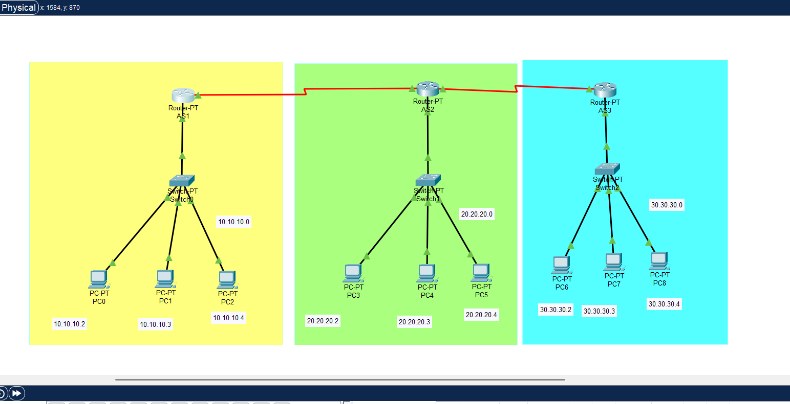

# Border Gateway Protocol (BGP) Configuration

- ⚙️ Tools: Cisco Packet Tracer



## First Router Configuration

```
Router>enable
Router#
Router#configure terminal
Enter configuration commands, one per line.  End with CNTL/Z.
Router(config)#interface FastEthernet0/0
Router(config-if)#no shutdown
Router(config-if)#
%LINK-5-CHANGED: Interface FastEthernet0/0, changed state to up

%LINEPROTO-5-UPDOWN: Line protocol on Interface FastEthernet0/0, changed state to up
ip address 10.10.10.1 255.0.0.0
Router(config-if)#ip address 10.10.10.1 255.0.0.0
Router(config-if)#
Router(config-if)#exit
Router(config)#interface Serial2/0
Router(config-if)#no shutdown
Router(config-if)#ip address 40.40.40.1 255.0.0.0
Router(config-if)#ip address 40.40.40.1 255.0.0.0
Router(config-if)#
%LINK-5-CHANGED: Interface Serial2/0, changed state to up

%LINEPROTO-5-UPDOWN: Line protocol on Interface Serial2/0, changed state to up

%LINEPROTO-5-UPDOWN: Line protocol on Interface FastEthernet0/0, changed state to down

%LINEPROTO-5-UPDOWN: Line protocol on Interface FastEthernet0/0, changed state to up

Router(config-if)#
Router(config-if)#
Router(config-if)#
Router(config-if)#en
Router(config-if)#exit
Router(config)#router bgp 1
Router(config-router)#net
Router(config-router)#network 10.0.0.0
Router(config-router)#network 40.0.0.0
Router(config-router)#nei
Router(config-router)#neighbor 40.40.40.2 re
Router(config-router)#neighbor 40.40.40.2 remote-as 2
Router(config-router)#exit
Router(config)#
```

## Second Router Configuration

```
Press RETURN to get started!


Router>enable
Router#
Router#configure terminal
Enter configuration commands, one per line.  End with CNTL/Z.
Router(config)#interface FastEthernet0/0
Router(config-if)#no shutdown
Router(config-if)#
%LINK-5-CHANGED: Interface FastEthernet0/0, changed state to up

%LINEPROTO-5-UPDOWN: Line protocol on Interface FastEthernet0/0, changed state to up
ip address 20.20.20.1 255.0.0.0
Router(config-if)#ip address 20.20.20.1 255.0.0.0
Router(config-if)#
Router(config-if)#exit
Router(config)#interface Serial2/0
Router(config-if)#no shutdown
Router(config-if)#
%LINK-5-CHANGED: Interface Serial2/0, changed state to up

%LINEPROTO-5-UPDOWN: Line protocol on Interface Serial2/0, changed state to up
ip address 40.40.40.2 255.0.0.0
Router(config-if)#ip address 40.40.40.2 255.0.0.0
Router(config-if)#
Router(config-if)#exit
Router(config)#interface Serial3/0
Router(config-if)#no shutdown
Router(config-if)#ip address 50.50.50.1 255.0.0.0
Router(config-if)#ip address 50.50.50.1 255.0.0.0
Router(config-if)#
%LINK-5-CHANGED: Interface Serial3/0, changed state to up

%LINEPROTO-5-UPDOWN: Line protocol on Interface Serial3/0, changed state to up


Router con0 is now available


Press RETURN to get started.


Press RETURN to get started!


Router>ena
Router>enable
Router#config t
Router#config terminal
Enter configuration commands, one per line.  End with CNTL/Z.
Router(config)#rout
Router(config)#router bg
Router(config)#router bgp 2
Router(config-router)#net
Router(config-router)#network 20.0.0.0
Router(config-router)#network 40.0.0.0
Router(config-router)#nei
Router(config-router)#net
Router(config-router)#network 50.0.0.0
Router(config-router)#nei
Router(config-router)#neighbor 40.40.40.1 re
Router(config-router)#neighbor 40.40.40.1 remote-as 1
Router(config-router)#%BGP-5-ADJCHANGE: neighbor 40.40.40.1 Up
neighbor 50.50.50.2 remote-as 3
Router(config-router)#exit
Router(config)#exit
Router#
%SYS-5-CONFIG_I: Configured from console by console

Router#

```

## Third Router Configuration

```
Router>enable
Router#
Router#configure terminal
Enter configuration commands, one per line.  End with CNTL/Z.
Router(config)#interface FastEthernet0/0
Router(config-if)#no shutdown
Router(config-if)#
%LINK-5-CHANGED: Interface FastEthernet0/0, changed state to up

%LINEPROTO-5-UPDOWN: Line protocol on Interface FastEthernet0/0, changed state to up
ip address 30.30.30.1 255.0.0.0
Router(config-if)#ip address 30.30.30.1 255.0.0.0
Router(config-if)#
Router(config-if)#exit
Router(config)#interface Serial2/0
Router(config-if)#no shutdown
Router(config-if)#
%LINK-5-CHANGED: Interface Serial2/0, changed state to up

%LINEPROTO-5-UPDOWN: Line protocol on Interface Serial2/0, changed state to up
ip address 50.50.50.2 255.0.0.0
Router(config-if)#ip address 50.50.50.2 255.0.0.0
Router(config-if)#


Router con0 is now available


Press RETURN to get started.


Press RETURN to get started!


Router>
Router>ena
Router>enable
Router#config t
Router#config terminal
Enter configuration commands, one per line.  End with CNTL/Z.
Router(config)#rout
Router(config)#router bgp
% Incomplete command.
Router(config)#router bgp 3
Router(config-router)#net
Router(config-router)#network 30.0.0.0
Router(config-router)#network 50.0.0.0
Router(config-router)#nei
Router(config-router)#neighbor 50.50.50.1 rem
Router(config-router)#neighbor 50.50.50.1 remote-as 2
Router(config-router)#%BGP-5-ADJCHANGE: neighbor 50.50.50.1 Up
exit
Router(config)#exit
Router#
%SYS-5-CONFIG_I: Configured from console by console
```
